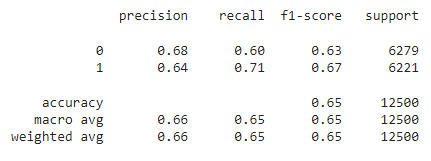

# NLP - IMDB review dataset analysis with SVC.

# Dataset
this project works with a dataset of 50,000 movie reviews from the Internet Movie Database (IMDb) and build a predictor that can distinguish between positive and negative review. The overall distribution of labels is balanced (25k pos and 25k neg).
1. SVC
2. TfidfVectorizer
3. NLTK
4. Numpy
5. Umap-Learn
# Conclusion

