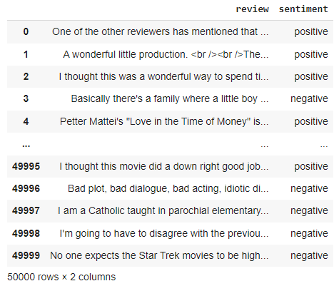

# IMDB review dataset analysis with Support Vector Classification.

### this project works with a dataset of 50,000 movie reviews from the Internet Movie Database (IMDb) and build a predictor that can distinguish between positive and negative review.
